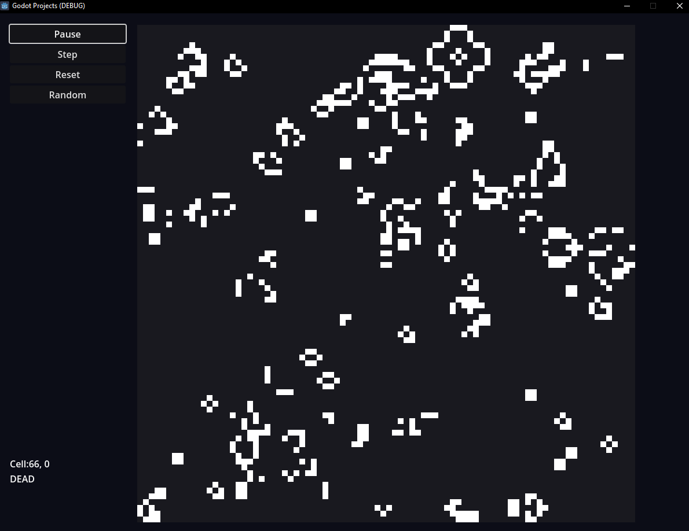

# Conway's Game of Life using Godot
Conway's Game of Life programmed using Godot to test GDScript power.

## GDScript opinion
- No power
- The same code using C is about 1000x faster.
- Poor performance for a simple 86x86 cell grid.
- NO STRONG TYPES
- INDENT BASED!!
- Another bad pseudo-functional language (Why, God, why??).

## When to use this project
Feel free to use anything under your own responsibility. You don't have to credit me. Perfect for 1st course college students. Don't ask me anything about it, I won't answer. Thanks!

## Why Conway's Game of Life
Conway's Game of Life is the perfect project to apply the most common concepts when learning a new language (in this case, I wanted to test GDScript) because it has all the main features expected: loops, references, arrays, copy operation, intercommunication between components, memory management, user input and output, etc.

## Results

## How to use it
- Open Godot.
- Select the project.
- Open project.
- Press play.

## Comments
- Borders act like dead cells.

## Reference
[Wikipedia - Conway's Game of Life.](https://en.wikipedia.org/wiki/Conway%27s_Game_of_Life)
In loving memory.